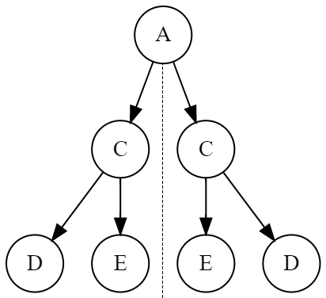

# Semana 6 - Arvores :herb:

-- --

## ABSTADA.py

### Enunciado:

> Magá era uma cã feliz, gostava de passear no parque e brincar com árvores binárias.
> Era tanta alegria ao lidar com esta estrutura de dados que ela até se perdia nas operações.
> Isso causava desgosto à Conja, que tinha convicção da diligência de Magá ao lidar com suas obrigações.
> Ajude Magá a ser feliz!
> Crie um programa que implementa uma ***Árvore Binária de Busca*** e aceita os comandos da Conja.
>
> São 5 comandos simples:
> ```
>    n: insere o valor inteiro n na árvore;
>    in: apresenta os elementos inseridos na forma infixa;
>    pre: apresenta os elementos inseridos na forma prefixa;
>    pos: apresenta os elementos inseridos na forma pósfixa; e
>    quack: interrompe o processamento (hora do banho de banheira).
> ```

### *Input*

**Enunciado:**

> A entrada contém uma quantidade indefinida de comandos a serem executados sobre sua árvore (inicialmente vazia).
> O final da entrada é sempre definido pelo comando ***quack***.
>
> Como por exemplo:
> ```
> 4
> 2
> 1
> 3
> 6
> 7
> 5
> in
> pre
> pos
> quack
> ```

### *Output*

**Enunciado:**

> Para cada comando de apresentar os elementos, liste-os em uma linha, na ordem definida e separados por espaço.
>
> Utilizando a entrada anterior, como por exemplo:
> ```
> 1 2 3 4 5 6 7
> 4 2 1 3 6 5 7
> 1 3 2 5 7 6 4
> ```

-- --

## valid_bst.py

### Enunciado:

> Uma ***Árvore Binária de Busca*** é uma estrutura de dados de árvore binária baseada em nós, onde todos os nós da subárvore esquerda possuem um valor numérico inferior ao nó raiz e todos os nós da subárvore direita possuem um valor superior ao nó raiz. 
>
> Neste exercício sua tarefa é escrever uma função chamada ***constituiArvoreBinariaDeBusca*** que recebe uma árvore binária e retorna um valor booleano indicando se essa árvore é ou não uma árvore binária de busca.

### *Input*

**Enunciado:**

>Não há entrada de dados, a função ***constituiArvoreBinariaDeBusca*** é chamada para valores arbitrários definidos nos casos de teste. Essa função recebe como entrada um parâmetro:
>
>    * raiz: Uma árvore binária, definida da seguinte forma:
>    ```python
>       class ArvoreBinaria():
>
>           def __init__(self, dado, esq = None, dir = None):
>               self.dado = dado
>               self.esq = esq
>               self.dir = dir
>    ```
> 
> Uma serie de instruçoes por exemplo:
> ```python
> raiz = ArvoreBinaria(2, ArvoreBinaria(1), ArvoreBinaria(3))
> print(constituiArvoreBinariaDeBusca(raiz))
> ```

### *Output*

**Enunciado:**

> A saída deve retornar um valor booleano indicando ```True``` se a árvore for uma árvore binária de busca e ```False```, caso contrário.
> 
> Utilizando as ultimas instruçoes, como exemplo:
> ```python
> True
> ```

-- --

## symetric_bt.py

### Enunciado:

> Todo mundo adora uma simetria! E com árvores binárias não vai ser diferente. Uma Árvore Binária é considerada simétrica se, dada uma árvore, suas sub-árvores são espelhos uma da outra, da seguinte forma:
> 
> Neste exercício sua tarefa é escrever uma função chamada ***verificaSimetria*** que recebe uma árvore binária e retorna um valor booleano indicando se essa árvore é ou não uma árvore binária simétrica.

## *Input*

**Enunciado:**

> Não há entrada de dados, a função ***verificaSimetria*** é chamada para valores arbitrários definidos nos casos de teste.
> Essa função recebe como entrada um parâmetro:
> * raiz: Uma árvore binária, definida da seguinte forma:
> ```python
>    class ArvoreBinaria():
>
>        def __init__(self, dado, esq = None, dir = None):
>            self.dado = dado
>            self.esq = esq
>            self.dir = dir
> ```
> 
> Como por exemplo:
> ```python
> raiz = ArvoreBinaria(1, ArvoreBinaria(0, ArvoreBinaria(1), ArvoreBinaria(0)), ArvoreBinaria(0, ArvoreBinaria(0), ArvoreBinaria(1)))
> print(verificaSimetria(raiz))
> ```

## *Output*

**Enunciado:**

>A saída deve retornar um valor booleano indicando ```True``` se a árvore for uma ávore binária simétrica e ```False```, caso contrário.
> 
> Utilizando o exemplo anterior, como exemplo:
> ```python
> True
> ```

-- -- 

# Codigos extras:

## arvore_teste.py

> **Teste de uma implementaçao de uma arvore.**

-- --

## sla

> **Arvore desbalanceada para testes.**